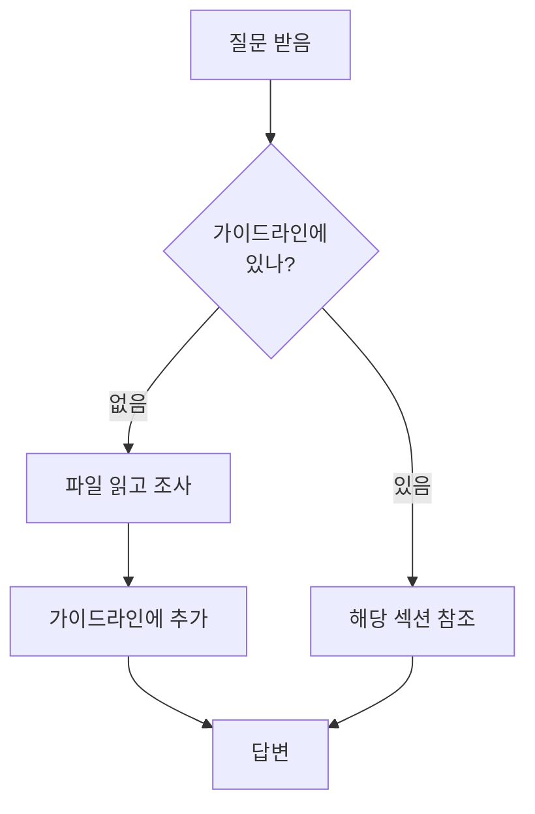

# Jake's Tech Insights - Claude Instructions

> 이 파일은 Claude가 작업 시작 전 **반드시** 읽어야 하는 필수 지침입니다.

## 🚨 작업 시작 전 필수 체크리스트

모든 작업 시작 전에 다음을 **순서대로** 확인:

1. **가이드라인 문서 읽기**
   ```
   docs/CLAUDE_GUIDELINES.md - 전체 작업 원칙
   docs/AUTOMATION_CONTEXT.md - 시스템 구조
   docs/WORK_LOG.md - 최근 작업 내역
   ```

2. **문제 관련 섹션 확인**
   - 이미지 문제 → CLAUDE_GUIDELINES.md "🖼️ Unsplash 이미지 관리"
   - 배포 문제 → CLAUDE_GUIDELINES.md "🚫 절대 금지 사항"
   - API 계산 → CLAUDE_GUIDELINES.md "⚠️ 과거 실수 사례"

3. **추측 금지**
   - 가이드라인에 있으면 → 참조만 하고 끝
   - 가이드라인에 없으면 → 파일 읽고 확인 후 추가

## 🎯 핵심 원칙

### 원칙 1: 문서 우선
```
질문 받음 → 가이드라인 확인 → 있으면 참조, 없으면 조사 후 추가
```

### 원칙 2: 추측 금지
```
불확실함 → "확인하겠습니다" → 파일 읽기 → 정확한 답변
```

### 원칙 3: 중복 방지
```
같은 로직 반복 설명 ❌
가이드라인 참조 링크 ✅
```

## 📋 자주 하는 질문 Quick Reference

### Q: 이미지가 왜 안 나와요?
→ [CLAUDE_GUIDELINES.md § Unsplash 이미지 관리](docs/CLAUDE_GUIDELINES.md#-unsplash-이미지-관리)
- Placeholder 파일 없음
- Fix Placeholder Images 워크플로우 실행

### Q: 로컬 서버 실행해야 하나요?
→ [CLAUDE_GUIDELINES.md § 절대 금지 사항](docs/CLAUDE_GUIDELINES.md#-절대-금지-사항)
- ❌ Hugo 로컬 서버 불필요
- ✅ Git Push → Cloudflare 자동 빌드

### Q: API 몇 번 써요?
→ [AUTOMATION_CONTEXT.md § API Usage](docs/AUTOMATION_CONTEXT.md)
- 키워드 생성: Google API 30회
- 콘텐츠 생성: Claude API (무제한)

### Q: 중복 이미지 어떻게 방지?
→ [CLAUDE_GUIDELINES.md § 중복 방지 시스템](docs/CLAUDE_GUIDELINES.md#중복-방지-시스템)
- used_images.json 추적
- Unsplash API 결과에서 미사용 이미지만 선택

## 🔄 작업 흐름



## 🌿 Git 브랜치 작업 규칙 (멀티 세션 환경)

### 원칙: 모든 작업은 브랜치에서

사용자가 여러 Claude 세션을 동시에 사용하므로 **main 브랜치에서 직접 작업 시 충돌 위험**이 있습니다.

### 작업 시작 전 확인

1. **사용자가 브랜치를 명시한 경우**
   ```
   "feature/task-5 브랜치에서 작업해줘"
   → 해당 브랜치로 이동하고 작업
   ```

2. **사용자가 브랜치를 명시하지 않은 경우 (대부분)**
   ```
   사용자: "Task 5 시작해줘"

   Claude: "다른 세션과의 충돌을 방지하기 위해
   feature/task-5 브랜치를 생성하여 작업하는 것이 안전합니다.

   진행하시겠습니까? 또는 main 브랜치에서 작업하시겠습니까?"
   ```

3. **사용자 응답에 따라**
   - "브랜치로" / "ㅇㅇ" → 브랜치 생성 후 작업
   - "main에서" / "그냥 해" → main 브랜치에서 작업 (충돌 위험 인지)

### 브랜치 명명 규칙

```
feature/[작업명]    - 새 기능 추가
fix/[문제명]        - 버그 수정
docs/[문서명]       - 문서 작업
refactor/[대상]     - 리팩토링
test/[테스트명]     - 테스트 작업
```

**예시:**
- `feature/task-5-ads-integration`
- `fix/image-placeholder-bug`
- `docs/update-readme`
- `refactor/post-generation-script`

### 작업 완료 후

```bash
# 1. 커밋
git add -A
git commit -m "feat: 작업 내용"

# 2. 푸시
git push origin feature/[브랜치명]

# 3. 사용자에게 알림
"feature/[브랜치명] 브랜치에 푸시 완료했습니다.
main 브랜치에 merge하시겠습니까?"
```

### 예외 상황

- **긴급 수정**: 사용자가 명시적으로 "main에서 바로 해줘"라고 요청한 경우만 main 작업
- **단순 조회**: 파일 읽기, 상태 확인 등은 브랜치 제안 불필요

## ⚠️ 절대 하지 말 것

1. ❌ 가이드라인 안 읽고 작업 시작
2. ❌ 추측으로 빠르게 답변
3. ❌ 같은 로직 반복 설명
4. ❌ Hugo 로컬 서버 실행 시도
5. ❌ "~일 것 같습니다" 발언
6. ❌ **"할 수 없습니다" 단정 짓기**
   - **GitHub CLI**: `/opt/homebrew/bin/gh`
   - **Hugo**: `/opt/homebrew/Cellar/hugo/0.154.5/bin/hugo`
   - 명령어 실패 시 → PATH 확인 → 전체 경로로 재시도
   - "안 된다"가 아니라 "방법을 찾겠습니다"
7. ❌ **사용자가 브랜치를 명시하지 않았는데 main 브랜치에서 바로 작업**
   - 항상 브랜치 작업을 제안하고 사용자 확인 받기

## ✅ 반드시 할 것

1. ✅ 작업 전 가이드라인 확인
2. ✅ 파일 읽고 확인 후 답변
3. ✅ 가이드라인 참조 링크 제공
4. ✅ 새로운 발견은 즉시 문서화
5. ✅ "확인하겠습니다" → 조사 → 정확한 답변

---

**이 지침을 따르지 않으면 토큰 낭비와 작업 반복이 발생합니다.**
**작업 시작 전 반드시 이 파일과 CLAUDE_GUIDELINES.md를 읽으세요.**
